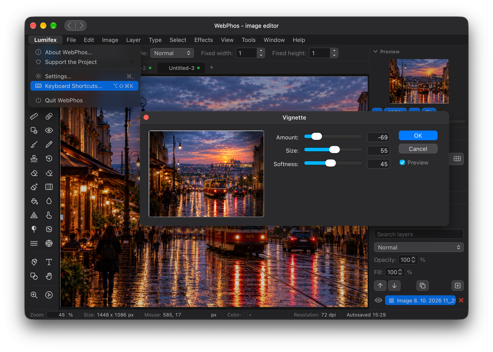

# Lumifex

[](LICENSE)
[](https://github.com/heptau/lumifex/actions)
[](https://lumifex.80.cz)

Lumifex is an image editor that runs directly in the browser. It is built with plain JavaScript and HTML5 canvas (no framework), looks like a native macOS application and works like Photoshop: layers, masks, selections, adjustments and effects with live preview, document tabs and history.

Nothing is sent to any server. Everything stays in your browser.

**Try it:** https://lumifex.80.cz/

[](https://lumifex.80.cz/)

## Features

- Layers with masks, styles and blend modes
- Selections of many kinds with live-preview refinement
- Adjustments and effects with live preview
- Retouching, drawing and text tools
- Several documents in tabs, history, autosave
- Import and export of common image formats, PDF and SVG
- Themes and languages that follow the system, keyboard accessible

## Development

```bash
npm install
npm run server   # development server
npm test         # tests
make build       # production build into docs/ (GitHub Pages)
```

More in [CONTRIBUTING.md](CONTRIBUTING.md). Developers and AI agents: see also [AGENTS.md](AGENTS.md) for the project structure and conventions.

## Contributing

Bug reports, ideas and pull requests are welcome, see [CONTRIBUTING.md](CONTRIBUTING.md). Security problems: see [SECURITY.md](SECURITY.md).

## License

MIT License, see [LICENSE](LICENSE). Lumifex is based on [miniPaint](https://github.com/viliusle/miniPaint) by ViliusL.
